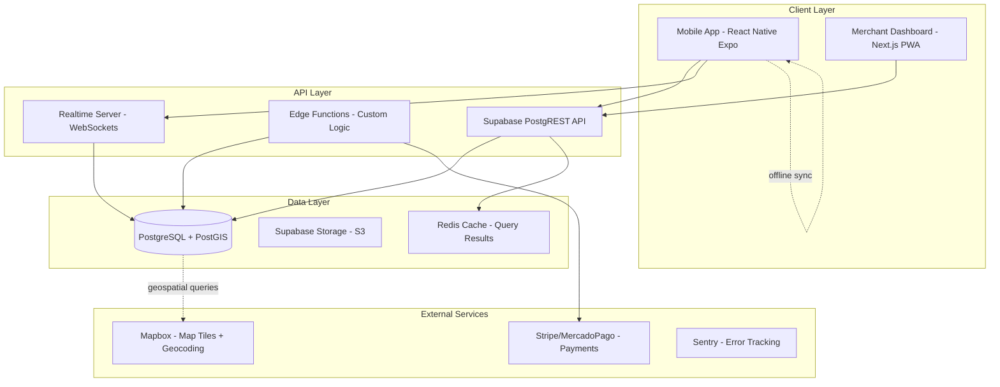

# 03 - Architecture

**Version:** 1.1
**Last Updated:** Enero 2026

## 10. ARQUITECTURA DEL SISTEMA

### 10.1 Stack Tecnológico Detallado

#### Frontend (Mobile)
- Framework: React Native (Expo SDK 51+)
- State Management: Zustand (lightweight, devtools support)
- Navigation: Expo Router (file-based routing)
- Maps: React Native Maps + Mapbox GL
- Offline Storage: @react-native-async-storage/async-storage
- API Client: TanStack Query (caching + optimistic updates)
- Forms: React Hook Form + Zod validation
- UI Library: React Native Paper (Material Design)

#### Backend (Serverless)
- BaaS: Supabase (PostgreSQL + Auth + Storage + Realtime)
- Database: PostgreSQL 15 con PostGIS extension
- Authentication: Supabase Auth (JWT-based)
- File Storage: Supabase Storage (S3-compatible)
- Edge Functions: Supabase Edge Functions (Deno runtime)
- Realtime: Supabase Realtime (WebSocket-based)

#### Infrastructure
- Hosting: Supabase Cloud (auto-scaling)
- CDN: Supabase CDN (global edge network)
- Maps: Mapbox (free tier: 50k monthly active users)
- Payments: Stripe (Mexico support) / MercadoPago (fallback)
- Monitoring: Sentry (error tracking) + Supabase Logs
- Analytics: PostHog (self-hosted opcional)
- CI/CD: GitHub Actions + EAS Build (Expo)

### 10.2 System Architecture Diagram



### 10.3 Data Model (Core Entities)

#### Entity Relationship Diagram

```sql
-- Users (Supabase Auth users extended)
CREATE TABLE profiles (
    id UUID PRIMARY KEY REFERENCES auth.users,
    full_name TEXT NOT NULL,
    avatar_url TEXT,
    phone TEXT,
    preferences JSONB, -- cycling level, dietary restrictions, etc.
    created_at TIMESTAMPTZ DEFAULT NOW(),
    updated_at TIMESTAMPTZ DEFAULT NOW()
);

-- Routes (with geospatial data)
CREATE TABLE routes (
    id UUID PRIMARY KEY DEFAULT gen_random_uuid(),
    name TEXT NOT NULL,
    description TEXT,
    path GEOGRAPHY(LineString, 4326) NOT NULL, -- PostGIS type
    distance_km NUMERIC(5,2) NOT NULL,
    elevation_gain_m INTEGER,
    difficulty TEXT CHECK (difficulty IN ('easy', 'moderate', 'hard')),
    estimated_duration_min INTEGER,
    metadata JSONB, -- surface type, traffic level, etc.
    created_by UUID REFERENCES profiles(id),
    status TEXT DEFAULT 'draft' CHECK (status IN ('draft', 'published', 'archived')),
    created_at TIMESTAMPTZ DEFAULT NOW(),
    updated_at TIMESTAMPTZ DEFAULT NOW()
);

CREATE INDEX idx_routes_path ON routes USING GIST(path);

-- Merchants
CREATE TABLE merchants (
    id UUID PRIMARY KEY DEFAULT gen_random_uuid(),
    owner_id UUID REFERENCES profiles(id),
    business_name TEXT NOT NULL,
    location GEOGRAPHY(Point, 4326) NOT NULL,
    address TEXT NOT NULL,
    phone TEXT NOT NULL,
    category TEXT NOT NULL, -- 'food', 'repair', 'lodging'
    opening_hours JSONB NOT NULL, -- {mon: "8:00-18:00", ...}
    is_active BOOLEAN DEFAULT FALSE,
    approval_status TEXT DEFAULT 'pending' CHECK (approval_status IN ('pending', 'approved', 'rejected')),
    commission_rate NUMERIC(3,2) DEFAULT 0.10, -- 10%
    created_at TIMESTAMPTZ DEFAULT NOW(),
    updated_at TIMESTAMPTZ DEFAULT NOW()
);

CREATE INDEX idx_merchants_location ON merchants USING GIST(location);
CREATE INDEX idx_merchants_category ON merchants(category) WHERE is_active = TRUE;

-- Products
CREATE TABLE products (
    id UUID PRIMARY KEY DEFAULT gen_random_uuid(),
    merchant_id UUID REFERENCES merchants(id) ON DELETE CASCADE,
    name TEXT NOT NULL,
    description TEXT,
    price NUMERIC(10,2) NOT NULL CHECK (price > 0),
    stock INTEGER NOT NULL DEFAULT 0,
    image_url TEXT,
    is_available BOOLEAN DEFAULT TRUE,
    category TEXT, -- 'beverage', 'snack', 'meal', 'gear'
    created_at TIMESTAMPTZ DEFAULT NOW(),
    updated_at TIMESTAMPTZ DEFAULT NOW()
);

CREATE INDEX idx_products_merchant ON products(merchant_id) WHERE is_available = TRUE;

-- Orders (with state machine)
CREATE TABLE orders (
    id UUID PRIMARY KEY DEFAULT gen_random_uuid(),
    user_id UUID REFERENCES profiles(id),
    merchant_id UUID REFERENCES merchants(id),
    total_amount NUMERIC(10,2) NOT NULL,
    estimated_pickup_time TIMESTAMPTZ NOT NULL,
    actual_pickup_time TIMESTAMPTZ,
    status TEXT NOT NULL DEFAULT 'pending'
        CHECK (status IN ('pending', 'confirmed', 'preparing', 'ready', 'completed', 'cancelled')),
    payment_intent_id TEXT, -- Stripe payment intent
    payment_status TEXT DEFAULT 'pending'
        CHECK (payment_status IN ('pending', 'completed', 'failed', 'refunded')),
    cancellation_reason TEXT,
    created_at TIMESTAMPTZ DEFAULT NOW(),
    updated_at TIMESTAMPTZ DEFAULT NOW()
);

CREATE INDEX idx_orders_user ON orders(user_id);
CREATE INDEX idx_orders_merchant ON orders(merchant_id, status);
CREATE INDEX idx_orders_status ON orders(status, created_at DESC);

-- Order Items
CREATE TABLE order_items (
    id UUID PRIMARY KEY DEFAULT gen_random_uuid(),
    order_id UUID REFERENCES orders(id) ON DELETE CASCADE,
    product_id UUID REFERENCES products(id),
    quantity INTEGER NOT NULL CHECK (quantity > 0),
    unit_price NUMERIC(10,2) NOT NULL,
    subtotal NUMERIC(10,2) NOT NULL,
    created_at TIMESTAMPTZ DEFAULT NOW()
);

-- Route Points of Interest (many-to-many)
CREATE TABLE route_pois (
    id UUID PRIMARY KEY DEFAULT gen_random_uuid(),
    route_id UUID REFERENCES routes(id) ON DELETE CASCADE,
    name TEXT NOT NULL,
    location GEOGRAPHY(Point, 4326) NOT NULL,
    type TEXT, -- 'viewpoint', 'rest-area', 'water-fountain'
    description TEXT,
    created_at TIMESTAMPTZ DEFAULT NOW()
);

CREATE INDEX idx_route_pois_location ON route_pois USING GIST(location);
```

### Key Design Decisions

1. **PostGIS para Geospatial Data**: Queries eficientes tipo "encuentra merchants a <5km de ruta"
2. **JSONB para Flexible Schema**: Preferences, metadata, opening hours (schema evolution sin migrations)
3. **Row Level Security (RLS)**: Supabase RLS policies para multi-tenant security
4. **State Machine en Orders**: Estado explícito para evitar race conditions
5. **Soft Deletes**: `is_active` flags en lugar de DELETE para audit trail

---

**Related Documents:**
- [02 - Requirements](./02-requirements.md)
- [09 - Security](./09-security.md)
- [10 - Deployment](./10-deployment.md)
